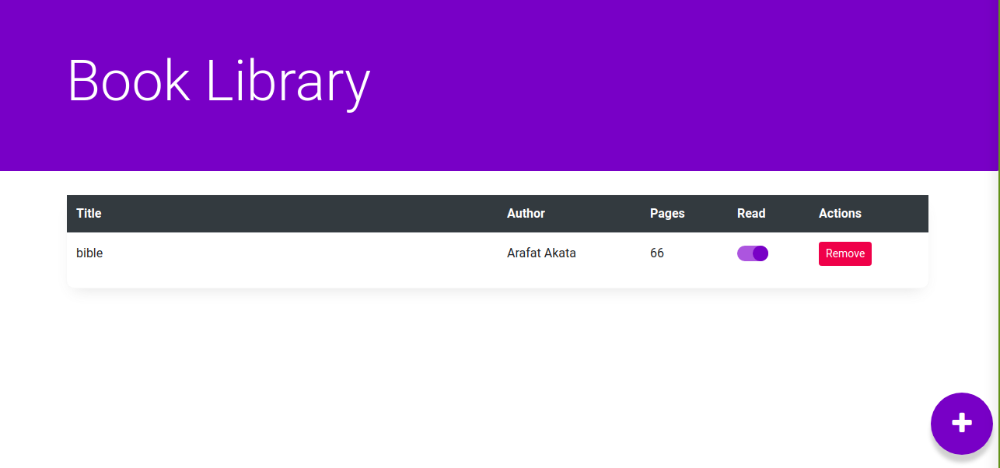

# booklibrary

This is a library app where you can add a book. The book has an attributes of; Name, Author, Number of Page, Delete and an ability for you to choose whether a book is read or not.

## Built With
This project development was achieved using the following technologies:

- Javascript
- Bootstrap and CSS

## Live Demo

NA[See Demo](https://tigamadou.github.io/booklibrary/) 

## Home Page of the Application

## Getting Started

To get a local copy up and running follow these simple example steps.

### Prerequisites

#### You should have installed git on your local machine and a text editor of your choice.
### Setup

- Forking the project-Repository
- Cloning the project to your local machine
- `cd` into the project directory
- right click on the index.html file and select open with a browser

## Author

👤 **Author**

- Github: [@haraphat01](https://github.com/haraphat01)

👤 **Author**

- Github: [@tigamadou](https://github.com/tigamadou)

## 🤝 Contributing

Contributions, issues and feature requests are welcome! Start by:

- Forking the project
- Cloning the project to your local machine
- `cd` into the project directory
- Run `git checkout -b your-branch-name`
- Make your contributions
- Push your branch up to your forked repository
- Open a Pull Request with a detailed description to the development branch of the original project for a review

## Show your support

Give a ⭐️ if you like this project!

Feel free to check the [issues page](issues/).

## Show your support

Give a ⭐️ if you like this project!

## Acknowledgments

- Appreciation to my coding Partner and mentor

## 📝 License

This project is [MIT](lic.url) licensed.

